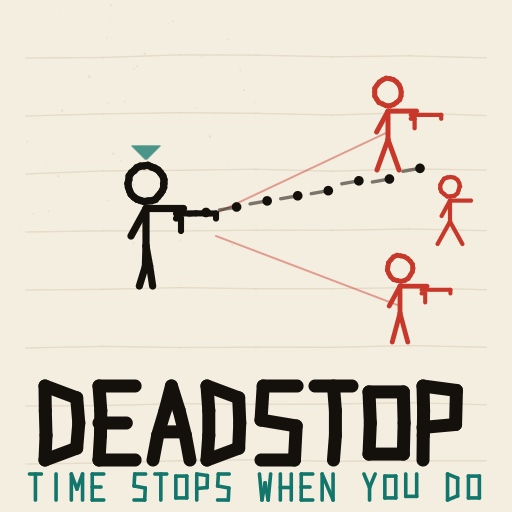
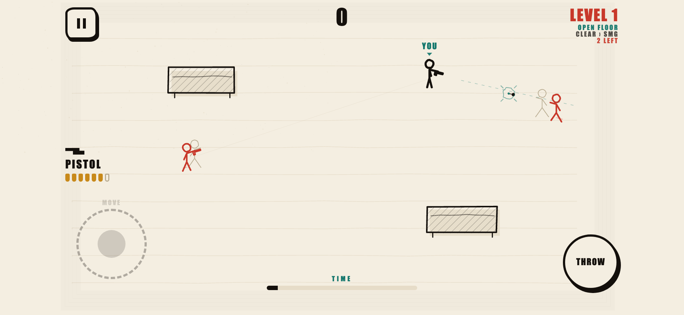

# DEADSTOP

> Time only breathes when you do.





DEADSTOP is an ink-on-paper stick-figure roguelike gunfight built for
[RUN.world](https://run.world/). The world clock is wired directly to your own
motion: stand still and the bullets hang in the air like pins on a corkboard;
move, swing your aim, or pull the trigger and the whole firefight surges
forward. Every gun has a hard round count, and when it runs dry the gun itself
is the last thing you can throw.

It plays in landscape, on desktop with mouse and keyboard or on touch with two
thumbs, and it renders with PixiJS 8 on a WebGPU-first path with an automatic
WebGL fallback.

## The loop

1. **Read the page.** Standing still holds the world at 4.5% speed. Frozen
   rounds, enemy sight lines, and the gaps between them are all readable.
2. **Spend the clock.** Every step, every degree of aim, and every shot pushes
   time forward for everyone else too.
3. **Count your rounds.** The pistol holds seven. Kill a grunt and take theirs,
   Once it is dry, one more click sends the frame itself downrange.
4. **Clear the level.** Every cleared level inks a bigger gun at your feet:
   SMG, shotgun, rifle, launcher, then round again with extra rounds.
5. **Pick a booster.** Between levels the run stops on a three-card draft. One
   pick, no going back, and it stays for the rest of the run.

One hit ends you. So does one hit on them.

## The run

A run is a ladder of procedurally drawn levels that only gets heavier. Six
floor plans (open, pillars, corridors, bunker, gauntlet, scrap room) are laid
out from the run seed, enemy families unlock at fixed levels, and from level 3
a page can be stamped with a twist: CROWDED, BARE PAGE, DIM LIGHT, SCARCE,
HAIR TRIGGER, MARKSMEN, HEAVY, SWARM. Every fifth level is an elite page with an
extra body, a guaranteed twist, and double the clear bonus.

**The run has no end and no difficulty ceiling.** There is no final level and no
win screen — you play until the page stops you. Body counts do top out, because
the arena is one screen, but past that point levels keep getting harder by
fielding better bodies rather than more of them: they move quicker, aim sooner,
fire tighter bursts, and take an extra round to put down. That pressure grows
without bound but logarithmically, and every stat it touches is separately
clamped, so a deep page is always a harder fight and never an unwinnable one.
Once all 26 booster stacks are taken, the between-level draft starts dealing
loaded guns instead, so it never runs dry.

Fourteen boosters stack across a run: STEADY HAND, QUICK FEET, LONG BARREL,
WIDE STEP, DEEP POCKETS, SCAVENGER, HEAVY THROW, COLD START, LONG BREATH,
TWIN TAP, PAPER CUT, RICOCHET, DEAD EYE, and SECOND SKIN. All fourteen are
drafted for free; ten can also be packed into a two-slot **kit** before a run
with ink earned from play.

## Controls

| Action | Desktop | Touch |
| --- | --- | --- |
| Move | `WASD` or arrow keys | The `MOVE` stick, bottom left |
| Aim and fire | Mouse aims, left click fires | **Tap a spot to shoot that spot**; hold to keep firing |
| Throw the gun | Click again once it is dry | Tap again once it is dry |
| Swap over a gun | `E` | Walk over it while empty |
| Pick a booster | `1` / `2` / `3` | Tap a card |
| Pause | `Esc` or `P` | Pause button |

**First run coaches you.** Three steps, each naming one rule and waiting for
you to do it: walk until you feel the clock move with you, fire a round, then
throw the empty gun. It cannot be dismissed by a stray keypress, and it never
appears again once you have done all three or cleared your first page.

On desktop the one thing you need to know stays on screen where a phone puts it:
`WASD / MOVE`, bottom-left. There is nothing else to learn.

**No keyboard required.** The on-screen sticks appear automatically on anything
that can be touched, and the control scheme follows whatever you last used, so a
hybrid laptop or a tablet with a keyboard is never stuck on WASD. Settings carry
`TOUCH CONTROLS = AUTO / ALWAYS ON / OFF`; with `ALWAYS ON` a mouse can drag the
sticks, which makes the game fully playable with no keyboard on any device.

Touch aiming is absolute: the whole page is a firing surface and the round goes
exactly where your finger lands, marked by an inked reticle before it fires. A
hostile within about a thumb's width of the tapped point captures the shot, so
tapping near someone hits them — but tapping empty page stays a shot at empty
page, and nothing ever fires on its own. Mouse aiming is unassisted.

Because the page fires, the one place that does not is drawn for you: a
permanent `MOVE` stick in the bottom-left corner, visible from the first frame.
Touch it and you steer; touch anything else, right up to the edge of its ring,
and you shoot. It takes under 5% of the screen, so the arena stays tappable. A
standing `TAP THE PAGE TO SHOOT` label says so out loud, since a firing surface
is the one control that cannot show itself.

## Scoring

Kills are worth 100–400 by family and multiply with style: `x3` for a thrown-gun
kill, **`x2.5` for a headshot**, `x1.5` for killing while the page is nearly
still, `x2` per extra body in one blast, `x1.25` point blank. Every figure
carries a head as well as a body, so a round through the head both connects and
pays. Kills within 2.5 world-seconds chain up to
`x3`. Grazing a round while time is slow pays 25. Clearing level `N` pays
`250 x N` plus 15 for every round you did not need, doubled on an elite page.

## Coming back

A seven-day ink ladder (60 / 80 / 110 / 140 / 180 / 220 / **400**) cycles behind
the `DAILY` button. Claims are gated on trusted server time and keyed by day, so
a rolled device clock mints nothing and a replay cannot double-grant.

One optional reminder goes with it: `DAILY PAGE REMINDER` in settings schedules
a single local notification for the morning after your last claim. It is off by
default, asks for the platform permission from your own tap, re-arms rather than
stacks, and is cancelled the moment you open the game yourself. There is no
streak nag and no "we miss you" ping — a notification has to be worth the
interruption.

## Sound

Sound effects are generated in Web Audio and ship no files. The score is one
authored loop, and it is wired to the same clock the world runs on: stand still
and the music drops and sinks behind a closed filter, as if heard through a
wall; move and it opens back up and lifts. You hear your own agency rather than
a soundtrack playing next to it.

## Pages

The whole game is drawn in one palette, called a page. `FIELD LEDGER` is free,
`GRAPH GRID` and `NIGHT SHIFT` are bought with ink earned from runs, and
`BLUEPRINT`, `CARBON`, and `RED PEN` come from the Ledger Pack and the First Pen
Bundle. Pages change nothing about how DEADSTOP plays.

## Development

Requirements: Node.js 22 or newer, npm.

```sh
npm ci
npm run dev            # http://localhost:5191
npm run dev:playground # RUN Playground host, Google sign-in required
```

Verification:

```sh
npm run typecheck
npm run test     # invariants, safe area, save schema, daily track, gameplay simulation
npm run lint
npm run build
npm run check    # all of the above plus the production build check
```

`scripts/simulate.ts` drives the headless core through real levels and asserts
the Standstill contract, the difficulty curve, procedural floor plans and
twists, booster effects, the draft, determinism, the weapon economy, cover, and
the anti-dead-end resupply. `scripts/check-version.mjs` guards the contracts around
gameplay: identity, fail-closed monetization, honest player copy, safe areas,
and release metadata.

Headless visual QA (`node scripts/visual-qa.mjs`) drives a local Chrome through
menus, the kit, the draft, a live firefight, every page palette, short-phone
touch safe areas, the portrait rotate nudge, reduced motion, and a throttled
performance sample. It writes
screenshots to `docs/qa/`.

`node scripts/generate-thumbnail.mjs` redraws `public/thumbnail.jpg` from code.

### Development URLs

- `?qa=1` installs the semantic QA bridge (development builds only).
- `?renderer=webgl` or `?renderer=webgpu` forces a renderer path.
- Five taps on the version label opens the host-gated monetization test bay.

## Architecture

```
src/game/      core.ts (headless deterministic simulation), scene.ts (Pixi
               renderer), art.ts (ink primitives and palettes), config.ts
               (all tuning), noiseRandom.ts (the only randomness source)
src/ui/        controller.ts (DOM screens, HUD, and input)
src/systems/   save, commerce, daily, rewarded and interstitial ads, the
               monetization foundation, server time
src/sdk/       the capability-gated RUN facade and safe-area maths
src/audio/     the fully procedural score and sound effects
src/qa/        the development-only browser contract
```

The core never touches the DOM, never reads a clock, and never calls
`Math.random`. Everything it does is a pure function of its seed and the input
stream, which is what makes `simulate.ts` a real proof rather than a smoke test.

## Audio

There are no audio files. Gunfire, paper, and the pen-tick metronome are all
built in Web Audio from filtered noise, and the metronome's pulse follows the
Standstill clock, so the score literally breathes with the player. Music, sound,
haptics, and reduced motion each have a persisted setting.

## Monetization

Every gun, enemy, level, twist, booster, and scoring rule is reachable with ink
earned from play. Money buys pages, removes the results break, and can top up
ink; it never unlocks content a free player cannot reach.

- **Ledger Pack** (199 RB) — the Blueprint and Carbon pages, permanently.
- **Ad-Free Forever** (299 RB) — removes the mandatory results break.
- **First Pen Bundle** (399 RB) — ad-free, both pages, and the Red Pen page.
- **Ink Cases** (99 / 249 / 499 RB) — 600 / 2,000 / 5,000 ink. Ink buys kit
  boosters and ink-priced pages, and is earned from every run. Grants are keyed
  by verified order id, so an interrupted checkout is honoured exactly once.
- **Second Wind** — an optional rewarded video on the death screen, once per
  run, three per day, that re-inks the current level and keeps the score. Runs
  that used it are labelled as assisted in the results.
- **Results break** — one interstitial after every third banked run, capped and
  skipped entirely for players who took the rewarded offer or bought ad-free.

Nothing is granted without a host-verified outcome, and every placement stays
fail-closed until RUN LiveOps enables it.

## Licence

See [LICENSE.md](LICENSE.md).
